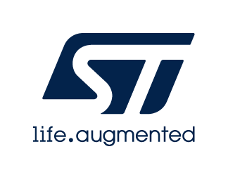

# Release Notes for <mark>STM32U3xx_Nucleo BSP Drivers</mark>
Copyright &copy; 2024 - 2026 STMicroelectronics\
    

# Purpose

The BSP (Board Specific Package) drivers are parts of the STM32Cube package based on the HAL drivers and provide a set of high level APIs relative to the hardware components and features in the evaluation boards, discovery kits and nucleo boards coming with the STM32Cube package for a given STM32 series.

The BSP drivers allow a quick access to the boards’ services using high level APIs and without any specific configuration as the link with the HAL and the external components is done in intrinsic within the drivers. 

From project settings points of view, user has only to add the necessary driver’s files in the workspace and call the needed functions from examples. However some low level configuration functions are weak and can be overridden by the applications if user wants to change some BSP drivers default behavior.

# Update History

<label for="collapse-section5" aria-hidden="true">__V1.2.0 / 03-June-2026__</label>

## Third Release

- Third Official Release of STM32CubeU3 Nucleo board BSP Drivers supporting STM32U335xx/STM32U345xx/STM32U356xx/STM32U366xx/STM32U375xx/STM32U385xx/STM32U3B5xx/STM32U3C5xx devices  

## Contents

- Release of board drivers for **NUCLEO-U345RC-Q board, NUCLEO-U366RE-Q board, NUCLEO-U385RG-Q board, NUCLEO-U3C5ZI-Q board**
	- in line with STM32Cube BSP drivers development guidelines (UM2298 - revision 2)

## Known Limitations

- None

## Dependencies

- None

## Notes

- stm32u3xx_nucleo_conf_template.h file must be copied in user application as stm32u3xx_nucleo_conf.h with optional configuration update

<label for="collapse-section4" aria-hidden="true">__V1.1.0 / 04-February-2026__</label>

## Second Release

- Second Official Release of STM32CubeU3 HAL/LL Drivers supporting STM32U375xx/STM32U385xx/STM32U3B5xx/STM32U3C5xx devices  

## Contents

- Release of board drivers for **NUCLEO-U385RG-Q board, NUCLEO-U3C5ZI-Q board**
	- in line with STM32Cube BSP drivers development guidelines (UM2298 - revision 2)

## Known Limitations

- None

## Dependencies

- None

## Notes

- stm32u3xx_nucleo_conf_template.h file must be copied in user application as stm32u3xx_nucleo_conf.h with optional configuration update

<label for="collapse-section3" aria-hidden="true">__V1.0.0 / 30-October-2024__</label>

## First Release

- First Official Release of STM32CubeU3 HAL/LL Drivers supporting STM32U375xx/STM32U385xx devices  

## Contents

- Release of board drivers for **NUCLEO-U385RG-Q board**
	- in line with STM32Cube BSP drivers development guidelines (UM2298 - revision 2)

## Known Limitations

- None

## Dependencies

- None

## Notes

- stm32u3xx_nucleo_conf_template.h file must be copied in user application as stm32u3xx_nucleo_conf.h with optional configuration update

For complete documentation on <mark>STM32 Microcontrollers</mark> ,
visit: [[www.st.com](http://www.st.com/STM32